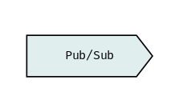
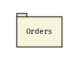
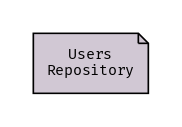
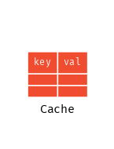
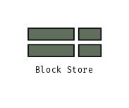
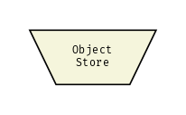
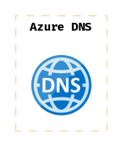
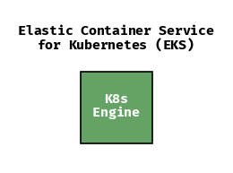

# Draft

[](https://goreportcard.com/report/github.com/lucasepe/draft) &nbsp;&nbsp;&nbsp;  &nbsp;&nbsp;&nbsp; [](https://twitter.com/intent/tweet?text=Wow:&url=https%3A%2F%2Fgithub.com%2Flucasepe%2Fdraft)

A commandline tool that generate **H**igh **L**evel microservice & serverless **A**rchitecture diagrams using a declarative syntax defined in a YAML file.

- Works on [linux, macOS, windows](https://github.com/lucasepe/draft/releases/latest)
- Just a [single portable binary file](https://github.com/lucasepe/draft/releases/latest)
- It Does One Thing Well
- Input data in flat YAML text files
- Usable with shell scripts

## How `draft` works?

`draft` takes in input a declarative YAML file and generates a [`dot`](https://en.wikipedia.org/wiki/DOT_(graph_description_language)) script for [Graphviz](https://www.graphviz.org/)

```bash
draft backend-for-frontend.yml | dot -Tpng -Gdpi=200 > backend-for-frontend.png 
```

Piping the `draft` output to [GraphViz](http://www.graphviz.org/doc/info/output.html/) `dot` you can generate the following output formats:

| format       | command                                                        |
|:-------------|:---------------------------------------------------------------|
| GIF          | <code>draft input.yml &#124; dot -Tgif > output.gif</code>     |
| JPEG         | <code>draft input.yml &#124; dot -Tjpg > output.jpg</code>     |
| PostScript   | <code>draft input.yml &#124; dot -Tps > output.ps</code>       |
| PSD          | <code>draft input.yml &#124; dot -Tpsd > output.psd</code>     |
| SVG          | <code>draft input.yml &#124; dot -Tsvg > output.svg</code>     |
| WebP         | <code>draft input.yml &#124; dot -Twebp > output.webp</code>   |

To install GraphViz to your favorite OS, please, follow this link [https://graphviz.gitlab.io/download/](https://graphviz.gitlab.io/download/).

## Components

> a picture is worth a thousand words 

... and this is particularly true in regard to complex IT architectures. 

The basic unit of each _draft_ design is the `component`:

```go
type Component struct {
  ID        string `yaml:"id,omitempty"`        // optional - autogenerated if omitted (read more for details...)
  Kind      string `yaml:"kind"`                // required - see the table below
  Label     string `yaml:"label,omitempty"`     // optional - works only for: 'queue', 'service', 'storage', 'function', 'database', 'client'  
  Outline   string `yaml:"outline,omitempty"`   // optional - you can use this to groups some components
  Impl      string `yaml:"impl,omitempty"`      // optional - you can use this to specify the implementation
  FillColor string `yaml:"fillColor,omitempty"` // optional - the hex code for the background color 
  FontColor string `yaml:"fontColor,omitempty"` // optional - the hex code for the foreground color
  Rounded   bool   `yaml:"rounded,omitempty"`   // optional - set to true if you wants rounded shapes
}
```

Draft uses a set of symbols independent from the different providers (AWS, Microsoft Azure, GCP). 

Eventually you can describe...

- the implementation using the `impl` attribute (ie: _impl: 'SQS'_)
- the cloud provider using the `provider` attribute (ie: _provider: AWS_)
  - 💡 components with the same provider will be 'grouped'

Below is a list of all the components currently implemented.

| Component            | Kind  | YAML                                        | Output                   | 
|:---------------------|:------|:--------------------------------------------|:------------------------:|
| **Client**           | `cli` | 👉 [examples/cli.yml](./examples/cli.yml)   |   |
| **Microservice**     | `ser` | 👉 [examples/ser.yml](./examples/ser.yml)   |   |  
| **API Gateway**      | `gtw` | 👉 [examples/gtw.yml](./examples/gtw.yml)   |   | 
| **Firewall**         | `waf` | 👉 [examples/waf.yml](./examples/waf.yml)   |   | 
| **K8s Engine**       | `kub` | 👉 [examples/kub.yml](./examples/kub.yml)   |   |
| **Pub / Sub**        | `msg` | 👉 [examples/msg.yml](./examples/msg.yml)   |   | 
| **Queue**            | `que` | 👉 [examples/que.yml](./examples/que.yml)   |   | 
| **Function**         | `fun` | 👉 [examples/fun.yml](./examples/fun.yml)   |   |
| **Relational DB**    | `rdb` | 👉 [examples/rdb.yml](./examples/rdb.yml)   |   | 
| **Document DB**      | `doc` | 👉 [examples/doc.yml](./examples/doc.yml)   |   | 
| **Caching**          | `mem` | 👉 [examples/mem.yml](./examples/mem.yml)   |   | 
| **Load Balancer**    | `lba` | 👉 [examples/lba.yml](./examples/lba.yml)   |   |
| **CDN**              | `cdn` | 👉 [examples/cdn.yml](./examples/cdn.yml)   |   |
| **DNS**              | `dns` | 👉 [examples/dns.yml](./examples/dns.yml)   |   |
| **Block Store**      | `bst` | 👉 [examples/bst.yml](./examples/bst.yml)   |   |
| **Object Store**     | `ost` | 👉 [examples/ost.yml](./examples/ost.yml)   |   |
| **File Store**       | `fst` | 👉 [examples/fst.yml](./examples/fst.yml)   |   |

## Auto filling the component implementation

Leave the `impl` fields empty and run [draft](https://github.com/lucasepe/draft/releases/latest) with the `-impl` flag to let [draft](https://github.com/lucasepe/draft/releases/latest) found the implementation by provider.

| example command                                                               | output                         |
|:------------------------------------------------------------------------------|:------------------------------:|
| <code>draft -impl aws ./examples/dns.yml &#124; dot -Tpng > test.png</code>   |     |
| <code>draft -impl azure ./examples/dns.yml &#124; dot -Tpng > test.png<code>  |   |
| <code>draft -impl gcp ./examples/kub.yml &#124; dot -Tpng > test.png<code>    |     |
| <code>draft -impl aws ./examples/kub.yml &#124; dot -Tpng > test.png<code>    |     |

... and so on for each kind of component!

### Notes about a component `id`

- you can define your component `id` explicitly (i.e. _id: MY_SERVICE_A_)
- or you can omit the component `id` attribute and it will be autogenerated

#### How is auto-generated a component `id`?

An auto-generated component `id` has a prefix and a sequential number

- the prefix is related to the component `kind`
  - examples _waf1, ..., wafN_ or _ser1, ..., serN_ etc.

## Connections

You can connect each component by arrows.

To be able to connect an _origin component_ with one or more _target component_ you need to specify each `componentId`.

A `connection` has the following properties:

```go
type Connection struct {
  Origin string `yaml:"origin"`
  Targets []struct {
    ID          string `yaml:"id"`
    Label       string `yaml:"label,omitempty"`
    Color       string `yaml:"color,omitempty"`
    Dashed      bool   `yaml:"dashed,omitempty"`
    Dir         string `yaml:"dir,omitempty"`
    Highlight   bool   `yaml:"highlight,omitempty"`
  } `yaml:"targets"`
}
```

[](https://twitter.com/intent/tweet?text=Wow:&url=https%3A%2F%2Fgithub.com%2Flucasepe%2Fdraft)

---

## Changelog

👉 [Record of all notable changes made to a project](./CHANGELOG.md)

---

## Examples

👉 [Collection of draft architecture descriptor YAML files](./examples/README.md)

---

(c) 2020 Luca Sepe http://lucasepe.it. MIT License 
