# Draft

A commandline tool that generate **H**igh **L**evel microservice & serverless **A**rchitecture diagrams using a declarative syntax defined in a YAML file.

- Works on Linux, Mac OSX, Windows
- Just a single portable binary file
- It Does One Thing Well
- Input data in flat YAML text files
- Usable with shell scripts

## How `draft` works?

`draft` takes in input a declarative YAML file and generates a [`dot`](https://en.wikipedia.org/wiki/DOT_(graph_description_language)) script for [Graphviz](https://www.graphviz.org/)

```bash
draft backend-for-frontend.yml | dot -Tpng -Gdpi=200 > backend-for-frontend.png 
```

Piping the `draft` output to [GraphViz](http://www.graphviz.org/doc/info/output.html/) `dot` you can generate the following output formats:

| format       | command                                                        |
|:-------------|:---------------------------------------------------------------|
| GIF          | <code>draft input.yml &#124; dot -Tgif > output.gif</code>     |
| JPEG         | <code>draft input.yml &#124; dot -Tjpg > output.jpg</code>     |
| PostScript   | <code>draft input.yml &#124; dot -Tps > output.ps</code>       |
| PSD          | <code>draft input.yml &#124; dot -Tpsd > output.psd</code>     |
| SVG          | <code>draft input.yml &#124; dot -Tsvg > output.svg</code>     |
| WebP         | <code>draft input.yml &#124; dot -Twebp > output.webp</code>   |

To install GraphViz to your favorite OS, please, follow this link [https://graphviz.gitlab.io/download/](https://graphviz.gitlab.io/download/).

## Components

> a picture is worth a thousand words 

... and this is particularly true in regard to complex IT architectures. 

The basic unit of each _draft_ design is the `component`:

```go
type Component struct {
  ID        string `yaml:"id,omitempty"`        // optional - autogenerated if omitted (read more for details...)
  Kind      string `yaml:"kind"`                // required (one of: service, gateway, queue, broker, function, storage, database)
  Label     string `yaml:"label,omitempty"`     // optional - the component description (or scope)  
  Provider  string `yaml:"provider,omitempty"`  // optional - you can use this to specify the cloud provider
  Impl      string `yaml:"impl,omitempty"`      // optional - you can use this to specify the implementation
  FillColor string `yaml:"fillColor,omitempty"` // optional - the hex code for the background color 
  FontColor string `yaml:"fontColor,omitempty"` // optional - the hex code for the foreground color
  Rounded   bool   `yaml:"rounded,omitempty"`   // optional - set to true if you wants rounded shapes
}
```

Draft uses a set of symbols independent from the different providers (AWS, Microsoft Azure, GCP).

Eventually you can describe...

- the implementation using the `impl` attribute (ie: _impl: 'SQS'_)
- the cloud provider using the `provider` attribute (ie: _provider: AWS_)
  - 💡 components with the same provider will be 'grouped'

Below is a list of all the components currently implemented.

| Component          | Kind        | YAML                      | Output                           |
|:-------------------|:------------|:--------------------------|:--------------------------------:|
| **Client**         | `client`    | 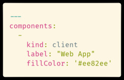    |        |
| **Microservice**   | `service`   |     | 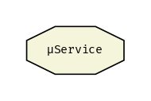      |
| **Gateway**        | `gateway`   | 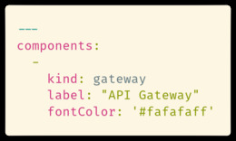    |       |
| **Message Broker** | `broker`    | 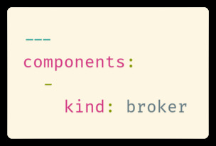    |        |
| **Queue Service**  | `queue`     | 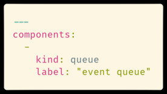    | 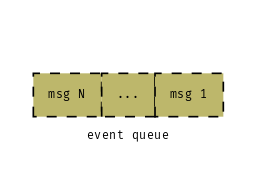        |
| **Object Storage** | `storage`   | 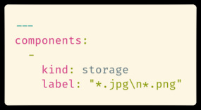    | 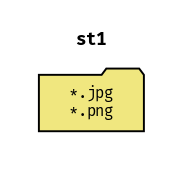      |
| **Function**       | `function`  | 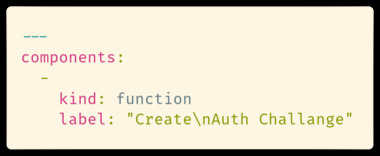    |      |
| **Database**       | `database`  | 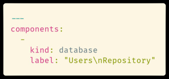    | 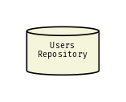     |

### Notes about a component `id`

- you can define your component `id` explicitly (i.e. _id: MY_SERVICE_A_)
- or you can omit the component `id` attribute and it will be autogenerated

#### How is auto-generated a component `id`?

An auto-generated component `id` has a prefix and a sequential number

- the prefix is related to the component `kind`

| a kind of... | will generate an `id` prefix with... | examples       |
|:-------------|:-------------------------------------|:---------------|
| `client`     | cl                                   | _cl1, cl2,..._ |
| `service`    | ms                                   | _ms1, ms2,..._ |
| `gateway`    | gt                                   | _gt1, gt2,..._ |
| `broker`     | br                                   | _br1, br2,..._ |
| `queue`      | qs                                   | _qs1, qs2,..._ |
| `storage`    | st                                   | _st1, st2,..._ |
| `function`   | fn                                   | _fn1, fn2,..._ |
| `database`   | db                                   | _db1, db2,..._ |

## Connections

You can connect each component by arrows.

To be able to connect an _origin component_ with one or more _target component_ you need to specify each `componentId`.

A `connection` has the following properties:

```go
type Connection struct {
  Origin struct {
    ComponentID string `yaml:"componentId"`
  } `yaml:"origin"`
  Targets []struct {
    ComponentID string `yaml:"componentId"`
    Label       string `yaml:"label,omitempty"`
    Color       string `yaml:"color,omitempty"`
    Dashed      bool   `yaml:"dashed,omitempty"`
    Dir         string `yaml:"dir,omitempty"`
    Highlight   bool   `yaml:"highlight,omitempty"`
  } `yaml:"targets"`
}
```

## Example 1 - Message Bus Pattern

The `draft` architecture descriptor YAML file is here 👉 [./examples/message-bus-pattern.yml](./examples/message-bus-pattern.yml)

Running `draft` with this command:

```bash
draft message-bus-pattern.yml | dot -Tpng > message-bus-pattern.png
```

Will generate this output:

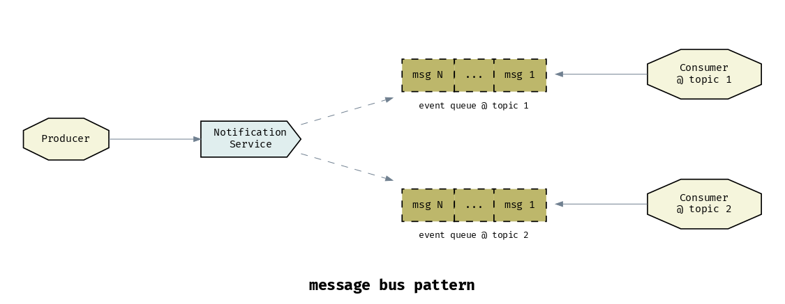


## Example 2 - AWS Cognito Custom Authentication Flow

The `draft` architecture descriptor YAML file is here 👉 [./examples/aws-cognito-custom-auth-flow.yml](./examples/aws-cognito-custom-auth-flow.yml)

Running `draft` with this command:

```bash
draft aws-cognito-custom-auth-flow.yml | dot -Tpng > aws-cognito-custom-auth-flow.png
```

Will generate this output:

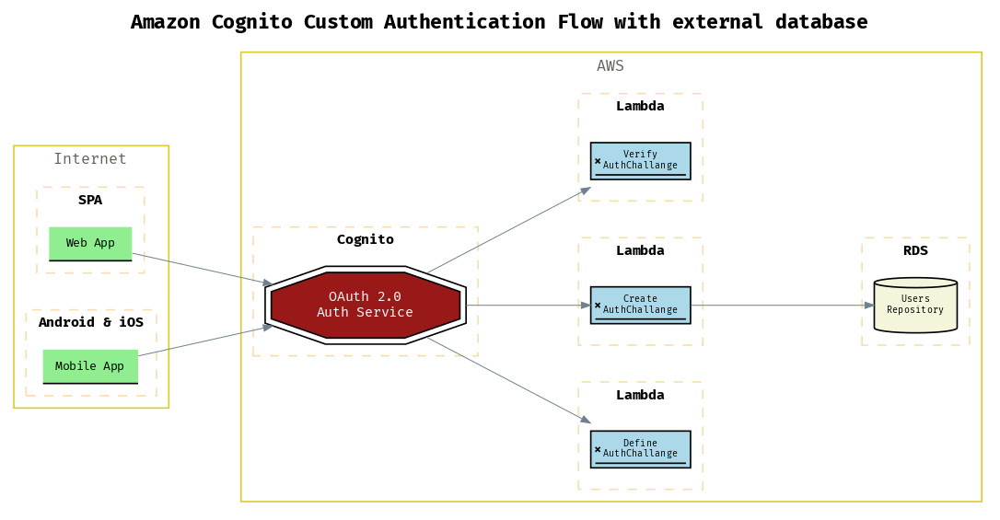

## Example 3 - Getting the pre-signed URL to Upload a file to Amazon S3


The `draft` architecture descriptor YAML file is here 👉 [./examples/s3-upload-presigned-url.yml](./examples/s3-upload-presigned-url.yml)

Running `draft` with this command:

```bash
draft s3-upload-presigned-url.yml | dot -Tpng > s3-upload-presigned-url.png
```

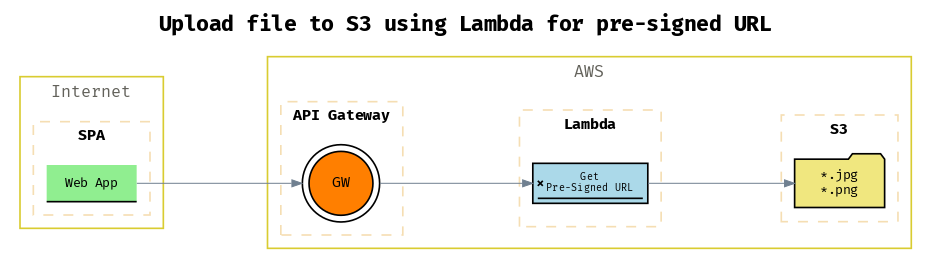

## Others examples

Check out the  👉 [./examples/](/examples/) folders for more `draft` architecture descriptor YAML examples.


---

(c) 2020 Luca Sepe http://lucasepe.it. MIT License
