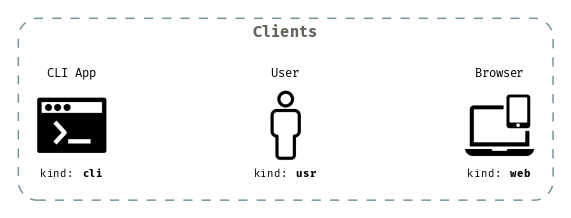
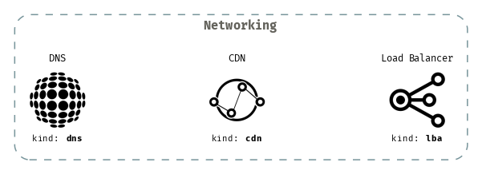
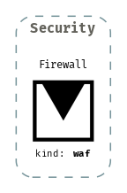
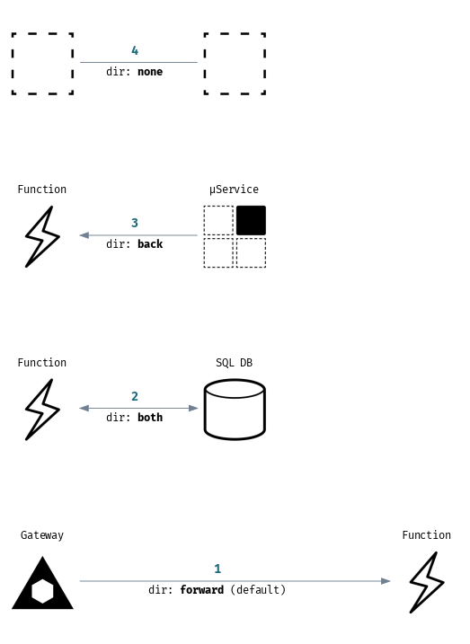

# Draft

A commandline tool that generate **H**igh **L**evel microservice & serverless **A**rchitecture diagrams using a declarative syntax defined in a YAML file.

- Works on [linux, macOS, windows](https://github.com/lucasepe/draft/releases/latest)
- Just a [single portable binary file](https://github.com/lucasepe/draft/releases/latest)
- Input data in flat YAML text files
- Usable with shell scripts


# Why?

I prefer to think in terms of capabilities rather than specific vendor services.

- _"do we need a DNS?"_ instead of _"do we need Route 53?"_
- _"do we need a CDN?"_ instead of _"do we need Cloudfront?"_
- _"do we need a database? if yes? what type? Relational? No SQL"_ instead of "do we need Google Cloud Datastore?"_
- _"do we need some serverless function?"_ instead of _"do we need an Azure Function"_

...and so on.

# How `draft` works?

`draft` takes in input a declarative YAML file and generates a [`dot`](https://en.wikipedia.org/wiki/DOT_(graph_description_language)) script for [Graphviz](https://www.graphviz.org/)

```bash
draft backend-for-frontend.yml | dot -Tpng -Gdpi=200 > backend-for-frontend.png 
```

Piping the `draft` output to [GraphViz](http://www.graphviz.org/doc/info/output.html/) `dot` you can generate different output formats:

| format       | command                                                        |
|:-------------|:---------------------------------------------------------------|
| PNG          | <code>draft input.yml &#124; dot -Tpng > output.png</code>     |
| JPEG         | <code>draft input.yml &#124; dot -Tjpg > output.jpg</code>     |
| PostScript   | <code>draft input.yml &#124; dot -Tps > output.ps</code>       |
| SVG          | <code>draft input.yml &#124; dot -Tsvg > output.svg</code>     |

To install GraphViz to your favorite OS, please, follow this link [https://graphviz.gitlab.io/download/](https://graphviz.gitlab.io/download/).

# Installation Steps

To build the binaries by yourself, assuming that you have `Go` installed, here the steps:

Clone the repo,
```psh
git clone https://github.com/lucasepe/draft.git
```

Move to the 'cmd' directory:
```psh
cd draft/cmd
```

Generate the static assets
```psh
go generate ../...
```

Build the binary tool
```psh
go build -o draft
```

# Components

The basic unit of each _draft_ design is the `component`, has these attributes:

| Name      | Required | Scope                         | Notes                                                   |
|:----------|:--------:|:------------------------------|---------------------------------------------------------|
| id        | no       | used for the connecttions     | autogenerated if omitted (read more for details...)     |
| kind      | yes      | identify the component type   | see [all available kinds](#list-of-all-available-kinds) |
| provider  | no       | get the specific provider icon| see [using custom icons](#using-custom-icons)           |
| label     | no       | text below the component icon | can contain basic HTML tags                             |
| outline   | no       | tag to group components       |                                                         |
| impl      | no       | text above the icon           | can use this to specify the provider implementation     |
| fontColor | no       | the label text color          | hex color code - supports transparency too              |

### Notes about a component `id`

- you can define your component `id` explicitly (i.e. _id: MY_SERVICE_A_)
- or you can omit the component `id` attribute and it will be autogenerated

### How is auto-generated a component `id`?

An auto-generated component `id` has a prefix and a sequential number

- the prefix is related to the component `kind`
  - examples _waf1, ..., wafN_ or _ser1, ..., serN_ etc.

# List of all available kinds

Draft uses a set of symbols independent from the different providers (AWS, Microsoft Azure, GCP). 

Below is a list of all the components currently implemented.

## Clients

Sample YAML file [examples/clients.yml](./examples/clients.yml).

```bash
draft -impl -verbose examples/clients.yml | dot -Gdpi=110 -Tpng > examples/clients.png
```



## Networking

Sample YAML file [examples/networking.yml](./examples/networking.yml).

```bash
draft -impl -verbose examples/networking.yml | dot -Gdpi=110 -Tpng > examples/networking.png
```



## Compute

Sample YAML file [examples/compute.yml](./examples/compute.yml).

```bash
draft -impl -verbose examples/compute.yml | dot -Gdpi=110 -Tpng > examples/compute.png
```


## Database

Sample YAML file [examples/database.yml](./examples/database.yml).

```bash
draft -impl -verbose examples/database.yml | dot -Gdpi=110 -Tpng > examples/database.png
```


## Storage

Sample YAML file [examples/storage.yml](./examples/storage.yml).

```bash
draft -impl -verbose examples/storage.yml | dot -Gdpi=110 -Tpng > examples/storage.png
```


## Security

Sample YAML file [examples/security.yml](./examples/security.yml).

```bash
draft -impl -verbose examples/security.yml | dot -Gdpi=110 -Tpng > examples/security.png
```



# Using custom icons

Here how to render components with specific _aws_, _google_ and _azure_ icons.

1. Download the <u>PNG</u> icons of your cloud provider [AWS](https://aws.amazon.com/it/architecture/icons/), [GCP](https://cloud.google.com/icons), [Azure](https://www.microsoft.com/en-us/download/details.aspx?id=41937)

2. Take only the icons related to the [components supported](#list-of-all-available-kinds) by [draft](https://github.com/lucasepe/draft/releases/latest)

3. Make a directory with the provider name (i.e. `/draft/icons/aws`, `/draft/icons/google`, `/draft/icons/azure`) 

4. Rename each icon as [draft](https://github.com/lucasepe/draft/releases/latest) components `kind` (i.e. `dns.png`, `cdn.png` and so on...)

5. Run [draft](https://github.com/lucasepe/draft/releases/latest) specifyng the icons folder using the environment variable `DRAFT_ICONS_PATH`
  - example: `DRAFT_ICONS_PATH=/draft/icons draft my-file.yml | dot > ark-aws.png`

👉 I have already done all the work for points 1 to 4. So you can avoid it by copying the directory [icons](./icons) 👈


# Connections

The arrows that join the components. 

To connect an _origin_ component with one or more _targets_ component you need to specify at least each `id`.

A _connection_ has the following properties:

| Attribute | Type     | Required | What is it?                    |
|:----------|:--------:|:--------:|--------------------------------|
| origin    | string   | yes      | id of the starting component   |
| targets   | object   | yes      | one or more destinations       |

Each _target_ has the following properties:

| Attribute      | Type     | Required | What is it?                                       |
|:---------------|:--------:|:--------:|---------------------------------------------------|
| id             | string   | yes      | target component id                               |
| label          | string   | no       | text on the connection                            |
| labeldistance  | float    | no       | distance of the label from the connection tail    |
| labelangle     | float    | no       | determine the label position relative to the tail |
| minlen         | float    | no       | sets the minimum connection length                |
| num            | int      | no       | usefult to track an order path on your graph      |
| color          | string   | no       | label color (hex color string)                    |
| dashed         | bool     | no       | if true the connection line will be dashed        |
| dir            | string   | no       | arrows direction (forward, back, both, none)      |
| highlight      | bool     | no       | if true makes the arrow thicker                   |


Sample YAML file [examples/connections.yml](./examples/connections.yml).

```bash
draft examples/connections.yml | dot -Gdpi=110 -Tpng > examples/connections.png
```




[](https://twitter.com/intent/tweet?text=Wow:&url=https%3A%2F%2Fgithub.com%2Flucasepe%2Fdraft)

---

## Changelog

👉 [Record of all notable changes made to a project](./CHANGELOG.md)

---

## Examples

👉 [Collection of draft architecture descriptor YAML files](./examples/README.md)

---

(c) 2020 Luca Sepe http://lucasepe.it. MIT License 
