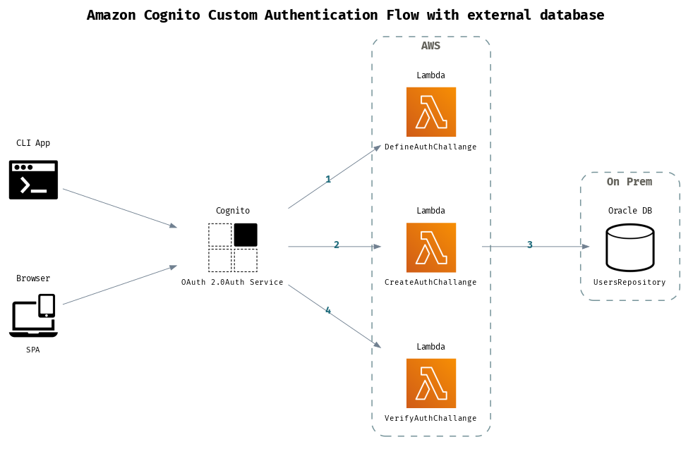
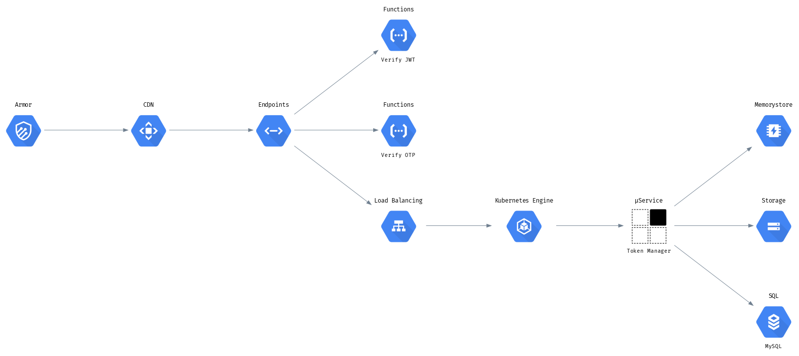
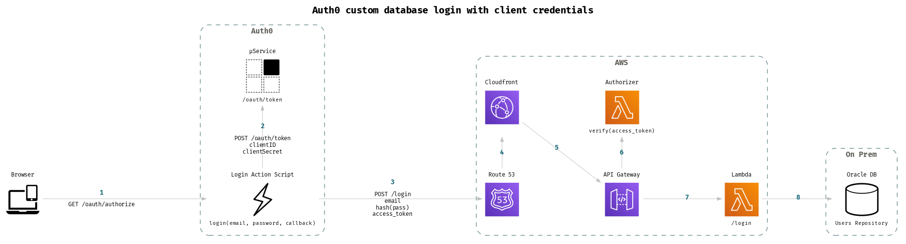

# Draft Examples

Collection of [draft](https://github.com/lucasepe/draft/releases/latest) architecture descriptor YAML files as examples.

## Sample 1 - Message Bus Pattern

The `draft` architecture descriptor YAML file is here 👉 [message-bus-pattern.yml](./message-bus-pattern.yml)

Running `draft` with this command:

```bash
draft -impl message-bus-pattern.yml | dot -Tpng > message-bus-pattern.png
```


## Sample 2 - Getting the pre-signed URL to Upload a file to Amazon S3

The `draft` architecture descriptor YAML file is here 👉 [s3-upload-presigned-url.yml](./s3-upload-presigned-url.yml)

Running `draft` with this command:

```bash
draft -impl s3-upload-presigned-url.yml | dot -Tpng > s3-upload-presigned-url.png
```


## Sample 3 - Amazon Cognito Custom Authentication Flow with external Database

The `draft` architecture descriptor YAML file is here 👉 [cognito-custom-auth-flow.yml](./cognito-custom-auth-flow.yml)

Running `draft` with this command:

```bash
draft -impl cognito-custom-auth-flow.yml | dot -Tpng > cognito-custom-auth-flow.png
```



## Example 4 - A Google Cloud Architecture

The `draft` architecture descriptor YAML file is here 👉 [token-manager-google.yml](./token-manager-google.yml)

Running `draft` with this command:

```bash
draft -impl token-manager-google.yml | dot -Tpng > token-manager-google.png
```



## Example 5 - Auth0 Custom Database Connection with Client Credentials

The `draft` architecture descriptor YAML file is here 👉 [auth0-custom-db-connection-with-jwt.yml](./auth0-custom-db-connection-with-jwt.yml)

Running `draft` with this command:

```bash
draft -impl auth0-custom-db-connection-with-jwt.yml | dot -Tpng > auth0-custom-db-connection-with-jwt.png
```




---

# Others examples

Check out this folder for more [draft](https://github.com/lucasepe/draft/releases/latest) architecture descriptor YAML examples.
