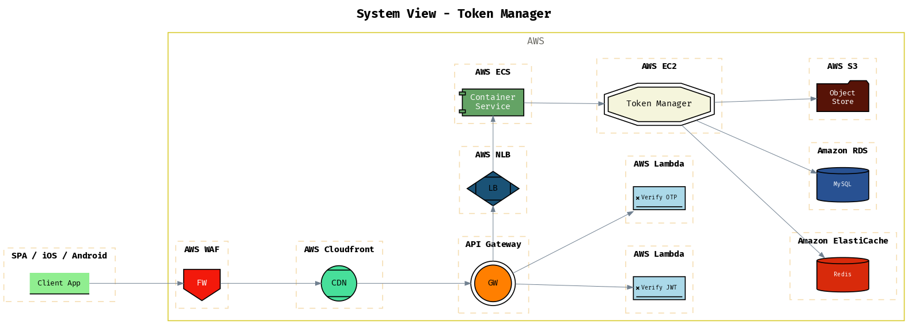

# Draft Examples

Collection of [draft](https://github.com/lucasepe/draft/releases/latest) architecture descriptor YAML files as examples.

## Example 1 - Message Bus Pattern

The `draft` architecture descriptor YAML file is here 👉 [./message-bus-pattern.yml](./message-bus-pattern.yml)

Running `draft` with this command:

```bash
draft message-bus-pattern.yml | dot -Tpng > message-bus-pattern.png
```

Will generate this output:


## Example 2 - AWS Cognito Custom Authentication Flow

The `draft` architecture descriptor YAML file is here 👉 [./aws-cognito-custom-auth-flow.yml](./aws-cognito-custom-auth-flow.yml)

Running `draft` with this command:

```bash
draft aws-cognito-custom-auth-flow.yml | dot -Tpng > aws-cognito-custom-auth-flow.png
```

Will generate this output:


## Example 3 - Getting the pre-signed URL to Upload a file to Amazon S3


The `draft` architecture descriptor YAML file is here 👉 [./s3-upload-presigned-url.yml](./s3-upload-presigned-url.yml)

Running `draft` with this command:

```bash
draft s3-upload-presigned-url.yml | dot -Tpng > s3-upload-presigned-url.png
```


## Example 4 - A system view

The `draft` architecture descriptor YAML file is here 👉 [./system-view.yml](./system-view.yml)

Running `draft` with this command:

```bash
draft system-view.yml | dot -Tpng > system-view.png
```




## Others examples

Check out this folder for more [draft](https://github.com/lucasepe/draft/releases/latest) architecture descriptor YAML examples.
