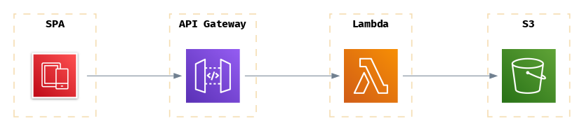
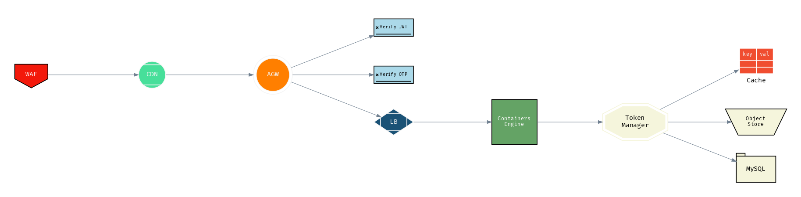
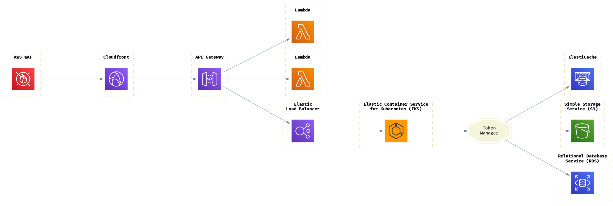
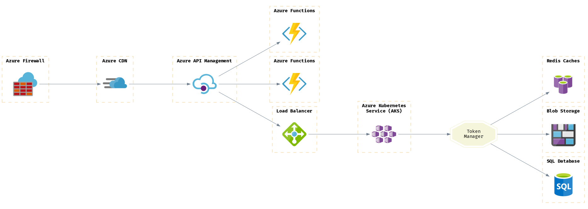

# Draft Examples

Collection of [draft](https://github.com/lucasepe/draft/releases/latest) architecture descriptor YAML files as examples.


## Example 1 - Getting the pre-signed URL to Upload a file to Amazon S3


The `draft` architecture descriptor YAML file is here 👉 [./s3-upload-presigned-url.yml](./s3-upload-presigned-url.yml)

Running `draft` with this command:

```bash
draft s3-upload-presigned-url.yml | dot -Tpng > s3-upload-presigned-url.png
```


Cool... But what if i would like to show AWS product names and icons! ...Here you are!

```bash
DRAFT_ICONS_PATH=../icons
draft -impl aws s3-upload-presigned-url.yml | dot -Tpng > s3-upload-presigned-url-aws.png
```




## Example 2 - A System View

The `draft` architecture descriptor YAML file is here 👉 [./impl-example.yml](./impl-example.yml)

Running `draft` with this command:

```bash
draft impl-example.yml | dot -Tpng > impl-example.png
```




Cool... But what if i would like to show AWS product names and icons! ...Here you are!

```bash
DRAFT_ICONS_PATH=../icons
draft -impl aws impl-example.yml | dot -Tpng > impl-example-aws.png
```




Great... and how it would be in Google cloud! ...Here you are!

```bash
DRAFT_ICONS_PATH=../icons
draft -impl gcp impl-example.yml | dot -Tpng > impl-example-gcp.png
```


Awesome!... and in Microsoft Azure, I dare you! ...Challange accepted!

```bash
DRAFT_ICONS_PATH=../icons
draft -impl azure impl-example.yml | dot -Tpng > impl-example-azure.png
```



---

# Others examples

Check out this folder for more [draft](https://github.com/lucasepe/draft/releases/latest) architecture descriptor YAML examples.
